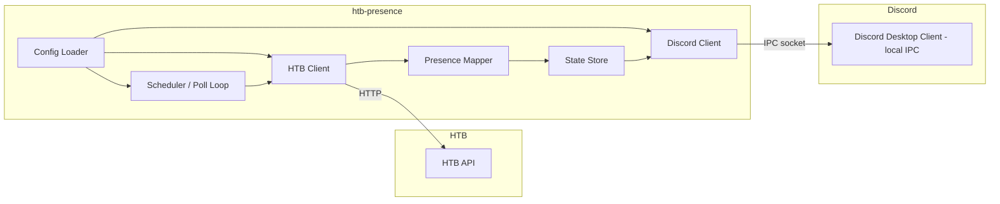

# Architecture

## 1. Overview

`htb-presence` is a small, long-running Go process built around a single loop:

**poll HTB → map to a presence state → push to Discord.**



## 2. Components

### 2.1 Config Loader (`internal/config`)

- Reads and validates the config file (YAML, see README for the example schema).
- Supplies typed config to every other component; nothing else touches the raw file.
- Responsible for defaults (e.g. poll interval floor of 15s) and validation errors that
  fail fast at startup with a clear message.

### 2.2 HTB Client (`internal/htb`)

**HTB has no public API for regular accounts** — only HTB Enterprise customers get an
officially documented API. `htb-presence` instead talks to the same internal REST API
that HTB's own web app (`app.hackthebox.com`) uses, the same way every community HTB
tool does: via a user-generated **App Token** against HTB's internal v4/v5 endpoints
(`https://www.hackthebox.com/api/v4/...`, `https://labs.hackthebox.com/api/v4/...`).
This is unofficial and undocumented by HTB, but reasonably well understood via
community reverse-engineering:

| Resource | What it's useful for |
|---|---|
| [`GoToolSharing/htb-cli`](https://github.com/GoToolSharing/htb-cli) | **Primary reference.** A full Go CLI using App Token auth against this same API — auth flow, request shape, and "active machine" detection can be studied directly since it's the same language. |
| [`Propolisa/htb-api-docs`](https://github.com/Propolisa/htb-api-docs) | Community-maintained Postman collection covering 100+ endpoints — the broadest endpoint reference. |
| [`T-Crypt/HTB-API`](https://github.com/T-Crypt/HTB-API) | Minimal curl/PowerShell examples per endpoint — good for quickly checking a response shape. |
| [`mxrch/htb_api`](https://github.com/mxrch/htb_api) | Endpoints pulled directly from HTB's frontend JS — useful cross-check when other docs are stale. |
| [`Pirrandi/htb-presence`](https://github.com/Pirrandi/htb-presence) | An existing Python project with the *same name and same goal* (VPN/machine/flag detection → Discord Rich Presence). Worth reading for the detection logic and UX even though the implementation language differs. |

**Responsibilities:**
  - Authenticate using the user's App Token (`Authorization: Bearer <token>`).
  - Fetch the user's current activity — the specific endpoint(s) for "active
    machine/session" must be confirmed against `GoToolSharing/htb-cli`'s source and/or
    `Propolisa/htb-api-docs` at implementation time, not assumed from this document.
  - Optionally fetch rank/points for display.
  - Translate HTTP/auth/rate-limit errors into typed errors the scheduler can react to
    (retry vs. fatal), and detect likely "API shape changed" errors (e.g. unexpected
    JSON structure) as a distinct, loud failure mode rather than silently returning
    zero-value data (see NFR-8 in `requirements.md`).
- Because this API is unofficial, the HTB Client is the single place in the codebase
  that knows about HTB's HTTP shapes — everything downstream (mapper, scheduler) only
  sees a small internal `Activity` type. This keeps an eventual API break to one
  package.
- **Fallback signal (no API call required):** local VPN connection state can be used as
  a cheap, always-available secondary signal — e.g. checking for an active OpenVPN
  process/`tun` interface — mirroring part of what `Pirrandi/htb-presence` does. This is
  optional and only meant to enrich/validate state, not replace the API-based activity
  fetch.

### 2.3 Scheduler / Poll Loop (`internal/presence` or `cmd/htb-presence`)

- Owns a ticker at the configured poll interval.
- On each tick: calls the HTB Client, feeds the result to the Presence Mapper, and hands
  the result to the Discord Client.
- Owns backoff/retry logic for both HTB API failures and Discord IPC disconnects, so
  neither failure mode takes down the process.
- Listens for OS signals (SIGINT/SIGTERM) for clean shutdown, including clearing the
  Discord presence on exit.

### 2.4 Presence Mapper (`internal/presence`)

- Pure function(s): `HTBActivity -> discord.Activity`.
- Applies user privacy toggles (hide machine name, hide rank, etc.) from config.
- Decides the fallback/idle state when there's no active HTB session.
- Kept dependency-free and easily unit-testable, since it's the core "business logic" of
  the app.

### 2.5 State Store (in-memory)

- Holds the last-known activity/presence state so the app can detect *changes* (only
  push updates to Discord when something actually changed, per FR-7) and can restore
  presence quickly after a reconnect.
- In-memory only for v1; no persistence to disk required.

### 2.6 Discord Client (`internal/discord`)

- Wraps Discord's Rich Presence IPC protocol (local Unix socket on macOS/Linux, named
  pipe on Windows).
- Responsibilities:
  - Handshake with the local Discord client using the configured application client ID.
  - Send `SET_ACTIVITY` payloads built by the Presence Mapper.
  - Detect disconnects and expose a reconnect method the scheduler can call with
    backoff.
- Hidden behind an interface (e.g. `PresencePublisher`) so the scheduler and mapper can
  be tested without a real Discord client.

## 3. Data flow (happy path)

1. `Config Loader` reads config at startup and validates it.
2. `Scheduler` starts, and `Discord Client` performs the initial IPC handshake.
3. On each poll tick, `HTB Client` fetches current activity from the HTB API.
4. `Presence Mapper` turns that activity (or lack thereof) into a Discord activity
   payload, applying privacy toggles.
5. `Scheduler` compares the new payload against `State Store`; if changed, it calls
   `Discord Client` to push the update and updates the store.
6. On shutdown, the `Scheduler` clears the Discord presence and closes the IPC
   connection.

## 4. Error handling & resilience

| Failure | Handling |
|---|---|
| HTB API unreachable / timeout | Log at warn level, retry with exponential backoff on the next poll tick(s); keep last known presence displayed. |
| HTB API auth failure (bad/expired App Token) | Log at error level with a clear message; keep retrying at a slower interval (token may be fixed by the user without restart) — exact behavior TBD, see open questions in `AGENTS.md`. |
| HTB API rate limited (HTTP 429) | Back off beyond the normal poll interval, honoring any `Retry-After` header if present; since limits aren't published, treat 429 as a strong signal to widen the interval further. |
| HTB API response shape unexpected (unofficial API changed) | Fail loudly at the HTB Client boundary (typed error, clear log), keep last known presence rather than mapping garbage data, and surface this distinctly from a plain network error so it's easy to spot in logs. |
| Discord not running | Retry IPC handshake with backoff; don't block the HTB polling loop while waiting. |
| Discord IPC drops mid-run | Reconnect with backoff; re-send last known presence once reconnected. |
| Process shutdown (SIGINT/SIGTERM) | Clear Discord presence, close IPC cleanly, exit 0. |

## 5. Suggested package layout

```
src/                         (or repo root — see AGENTS.md note)
├── cmd/
│   └── htb-presence/
│       └── main.go          # wiring: config → clients → scheduler
├── internal/
│   ├── config/               # config file loading & validation
│   ├── htb/                  # HTB API client + types
│   ├── discord/               # Discord IPC client + types
│   └── presence/              # scheduler + mapper + state store
└── go.mod
```

## 6. Key design decisions (and why)

- **Interfaces around both external systems (HTB, Discord).** Neither the HTB API nor
  the Discord client is available in a typical CI/test environment, so the core logic
  (mapping + scheduling) is designed to be tested without either.
- **Single poll loop, no queues/workers.** The workload is low-frequency (one poll every
  15s+) and single-user, so a simple ticker loop is sufficient — no need for a job
  queue or multiple goroutine pools.
- **In-memory state only.** v1 has no requirement to persist history (see
  `requirements.md` §2.2), so there's no database/storage layer.

## 7. Open design questions

See `AGENTS.md` → "Open questions worth flagging to a human" for items that need a
decision before implementation (repo layout, exact HTB endpoints to call, license).

## 8. Resources consulted for the HTB integration approach

- [GoToolSharing/htb-cli](https://github.com/GoToolSharing/htb-cli) — Go CLI, same App
  Token auth model, closest reference implementation.
- [Pirrandi/htb-presence](https://github.com/Pirrandi/htb-presence) — existing project
  with the same goal (Python); see its `README-EN.md` for the detection approach.
- [Propolisa/htb-api-docs](https://github.com/Propolisa/htb-api-docs) — community
  Postman collection of HTB v4 API endpoints.
- [T-Crypt/HTB-API](https://github.com/T-Crypt/HTB-API) — per-endpoint curl examples.
- [mxrch/htb_api](https://github.com/mxrch/htb_api) — endpoints extracted from HTB's
  frontend JavaScript.
